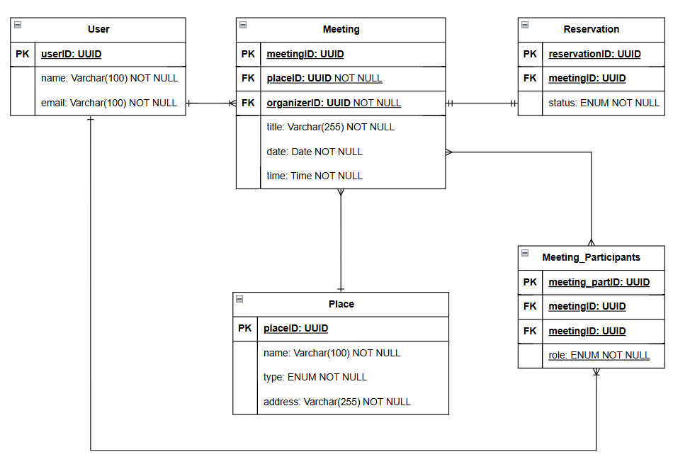

# Модель данных

import Drawio from '@theme/Drawio'
import diagram from '!!raw-loader!./model.drawio';

<Drawio content={diagram} editable={false} />

## Mapmates

#### Основные сущности:

1. **Пользователь (User)** — хранит информацию о пользователях системы.

2. **Встреча (Meeting)** — хранит информацию о встречах.

3. **Заведение (Place)** — хранит информацию о заведениях, где можно забронировать места.

4. **Бронь (Reservation)** — хранит данные о бронировании мест для встречи.

#### Связи:

5. Пользователь может быть организатором или участником на нескольких встречах (*"многие ко многим"* между `User` и `Meeting`).

6. Встреча может проходить в одном заведении ("один ко многим" между `Place` и `Meeting`).

7. Встреча может иметь статус брони ("один к одному" между `Meeting` и `Reservation`).

8. **User**

|Атрибут|Тип данных|Ключ|Описание|
|-|-|-|-|
|`id`|UUID|Первичный|Уникальный идентификатор|
|`name`|VARCHAR(100)||Имя пользователя|
|`email`|VARCHAR(100)|Уникальный|Почта|

1. **Meeting**

|Атрибут|Тип данных|Ключ|Описание|
|-|-|-|-|
|`id`|UUID|Первичный|Уникальный идентификатор|
|`title`|VARCHAR(255)||Название встречи|
|`date`|DATE||Дата встречи|
|`time`|TIME||Время встречи|
|`organizer_id`|UUID|Внешний|ID организатора (**User**)|
|`place_id`|UUID|Внешний|ID заведения (**Place**)|

1. **Place**

|Атрибут|Тип данных|Ключ|Описание|
|-|-|-|-|
|`id`|UUID|Первичный|Уникальный идентификатор|
|`name`|VARCHAR(255)||Название заведения|
|`type`|ENUM||Тип заведения (cafe, restaurant, fastfood)|
|`address`|VARCHAR(255)||Адрес заведения|

1. **Reservation**

|Атрибут|Тип данных|Ключ|Описание|
|-|-|-|-|
|`id`|UUID|Первичный|Уникальный идентификатор|
|`meeting_id`|UUID|Внешний|ID встречи (**Meeting**)|
|`status`|ENUM||Статус брони (confirmed, declined, no_place)|

5.  **Meeting_Participants (Участие во встречах)**

|Атрибут|Тип данных|Ключ|Описание|
|-|-|-|-|
|`meeting_partID`|UUID|Первичный|Уникальный идентификатор|
|`user_id`|UUID|Внешний|ID пользователя (**User**)|
|`meeting_id`|UUID|Внешний|ID встречи (**Meeting**)|
|`role`|ENUM||Роль (участник, создатель)|

