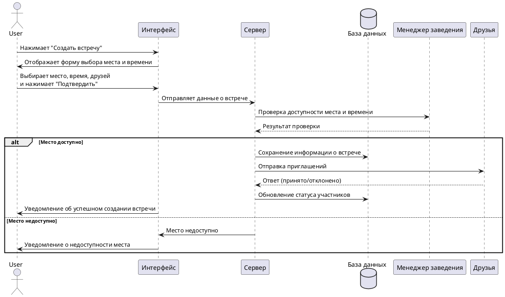

# Сценарий создания встречи

```plantuml

@startuml
actor User as Пользователь
participant "Интерфейс"
participant "Сервер"
database "База данных" as БазаДанных
participant "Менеджер заведения" as МенеджерЗаведения
participant "Друзья"

Пользователь -> Интерфейс: Нажимает "Создать встречу"
Интерфейс -> Пользователь: Отображает форму выбора места и времени
Пользователь -> Интерфейс: Выбирает место, время, друзей\nи нажимает "Подтвердить"
Интерфейс -> Сервер: Отправляет данные о встрече
Сервер -> МенеджерЗаведения: Проверка доступности места и времени
МенеджерЗаведения --> Сервер: Результат проверки

alt Место доступно
    Сервер -> БазаДанных: Сохранение информации о встрече
    Сервер -> Друзья: Отправка приглашений
    Друзья --> Сервер: Ответ (принято/отклонено)
    Сервер -> БазаДанных: Обновление статуса участников
    Интерфейс -> Пользователь: Уведомление об успешном создании встречи
else Место недоступно
    Сервер -> Интерфейс: Место недоступно
    Интерфейс -> Пользователь: Уведомление о недоступности места
end

@enduml


```

## Описание алгоритма

1. Шаг первый
2. Шаг второй
3. Шаг третий