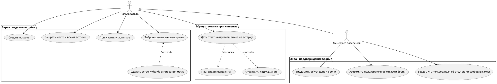

# Сценарий создания встречи

```plantuml

@startuml

"Пользователь" as User
"Менеджер заведения" as Admin

package "Экран создания встречи" {
User --> (Создать встречу)
User --> (Выбрать место и время встречи)
User --> (Пригласить участников)
User --> (Забронировать место встречи)
(Забронировать место встречи) <.. (Сделать встречу без бронирования места) : <<extend>>
}

package "Экран ответа на приглашение" {
User --> (Дать ответ на приглашениее на встерчу)
(Дать ответ на приглашениее на встерчу) ..> (Принять приглашение) : <<include>>
(Дать ответ на приглашениее на встерчу) ..> (Отклонить приглашение) : <<include>>
}

package "Экран поддверждения брони"{
Admin --> (Уведомить об успешной брони)
Admin --> (Уведомить пользователя об отказе в брони)
Admin --> (Уведомить пользователя об отсутствии свободных мест)
}

User <|-- Admin

@enduml


```

## Описание

1. Пользователь может ...
2. Менеджер может ...
3. Менеджео может быть пользователем.